#  UMC Product Web

> **UMC 데모데이 리크루팅 플랫폼**
> 모집 공고 등록부터 지원, 서류 심사, 팀 매칭, 활동 관리까지 리크루팅 전 과정을 하나의 웹 서비스로 연결합니다.

🔗 **서비스 바로가기** : [university.neordinary.com](https://university.neordinary.com)

<br/>

## 🗓️ 프로젝트 기간

> **2026.03 ~ ing**

<br/>

## 📱 프로젝트 소개

> **UMC Product Web**은 동아리 데모데이 프로젝트의 팀 빌딩을 자동화하는 서비스입니다.
> 운영진은 매칭 차수를 열고, Plan 챌린저는 프로젝트 공고를 올려 지원서를 심사하며, 기타 챌린저는 원하는 프로젝트에 지원해 매칭 결과를 확인합니다.
> 흩어져 있던 폼·시트·메신저 기반 리크루팅을 **하나의 흐름**으로 묶는 것을 목표로 합니다.

### 🧭 서비스 구성

서비스는 **데모데이 매칭**과 **리크루팅** 두 개의 도메인으로 구성됩니다.

| 도메인            | 범위                                          | 상태                  |
| :---------------- | :-------------------------------------------- | :-------------------- |
| **데모데이 매칭** | 프로젝트 공고 등록 → 지원 → 심사 → 팀 매칭    | 개발 완료 · 배포 완료 |
| **리크루팅**      | 모집 공고 → 지원 → 서류·면접 평가 → 최종 발표 | 개발 완료 · 미배포    |

> 리크루팅 도메인은 전 기능 구현을 마쳤으나 안정화가 완료되지 않아 실서비스에 공개하지 않았습니다.
> 아래 리크루팅 관련 기능·화면은 모두 구현된 상태를 기준으로 작성되었습니다.

<br/>

### 👥 사용자 역할

| 역할            | 설명                                                                     |
| :-------------- | :----------------------------------------------------------------------- |
| **운영진**      | 동아리 서비스 전반을 운영하고, 매칭 일정(차수)을 관리·공지합니다.        |
| **Plan 챌린저** | 프로젝트 공고를 등록하고, 들어온 지원서를 심사해 합격자를 선별합니다.    |
| **기타 챌린저** | 원하는 프로젝트에 지원서를 제출하고, 매칭 결과와 활동 기록을 확인합니다. |

<br/>

### ⭐ 핵심 기능

**1. 데모데이 매칭** - 챌린저가 프로젝트 팀에 배정되기까지

| Feature                 | Description                                                         |
| :---------------------- | :------------------------------------------------------------------ |
| 매칭 차수 관리          | 매칭 라운드 생성·관리 및 매칭 기간 설정                             |
| 프로젝트 공고 등록·관리 | Plan 챌린저가 공고를 작성하고 지원서 문항을 드래그 앤 드롭으로 구성 |
| 프로젝트 탐색 · 지원    | 모집 중인 프로젝트 조회·필터링 및 지원서 제출                       |
| 지원자 심사             | 지원자 목록과 지원서 상세 확인 후 합·불 판정                        |
| 결과 공고 발행          | 매칭 결과를 정리해 공고로 발행                                      |

<br/>

**2. 리크루팅** - 지원자가 UMC에 합류하기까지

| Feature             | Description                                                 |
| :------------------ | :---------------------------------------------------------- |
| 모집 공고 등록·관리 | 모집 차수 생성, 지원서 문항 구성, 파트별 정원 설정          |
| 지원서 제출         | 공개 모집 공고 확인 후 비로그인 상태로 지원서 작성·제출     |
| 내 지원 현황 확인   | 본인이 제출한 지원서와 단계별 진행 상태 조회                |
| 서류 · 면접 평가    | 평가자 배정, 서류/면접 평가 입력, 면접 일정 관리, 최종 확정 |
| 지원 현황 대시보드  | 지부·학교·파트별 지원자 집계와 진행률을 차트로 조회         |
| 리크루팅 히스토리   | 지난 차수의 지원·평가 기록 아카이브 조회                    |

<br/>

**3. 공통**

| Feature            | Description                                                 |
| :----------------- | :---------------------------------------------------------- |
| 로그인 / 회원가입  | 자체 로그인 및 카카오·구글·애플 OAuth, 챌린저 자격 인증     |
| 챌린저 관리        | 합류한 챌린저의 활동 기록 조회 및 상벌점 부여               |
| 조직 관리          | 지부·학교·커리큘럼 등 동아리 조직 정보 관리                 |
| 계정 설정          | 비밀번호·이메일·닉네임 등 계정/프로필 정보 변경             |
| 서비스 소개 페이지 | 로그인 전 랜딩 페이지 제공, SEO를 위한 공개 경로 프리렌더링 |

<br/>

### 📖 팀 매칭 시스템 사용 가이드

> 서비스 배포와 함께 챌린저에게 제공한 사용 매뉴얼입니다. 매칭 플로우 전체를 순서대로 담고 있습니다.
> 각 단계를 펼치면 해당 화면과 설명을 볼 수 있습니다.

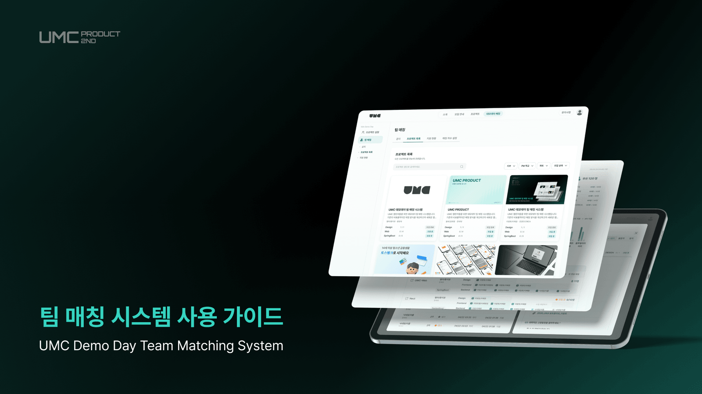

<details>
<summary><strong>1. 프로젝트 등록</strong> — Plan 챌린저가 매칭 기간 전 프로젝트를 등록합니다</summary>

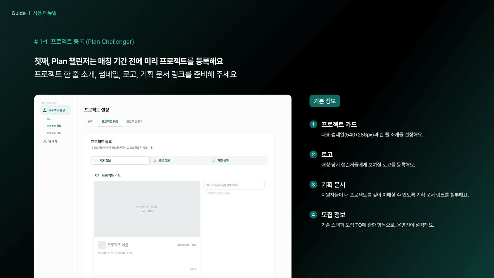
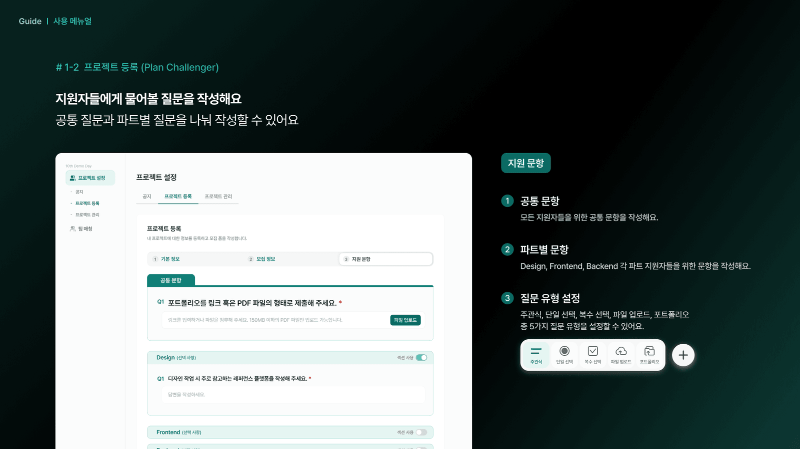

</details>

<details>
<summary><strong>2. 프로젝트 확인</strong> — 챌린저가 소속 지부의 프로젝트를 조회합니다</summary>

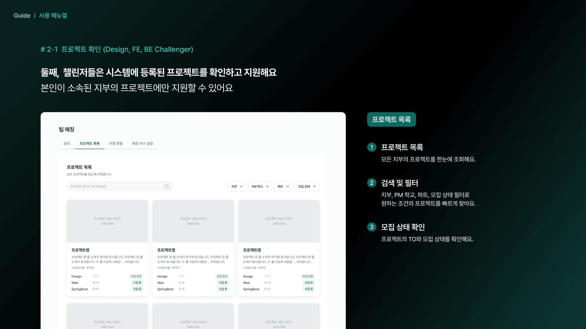
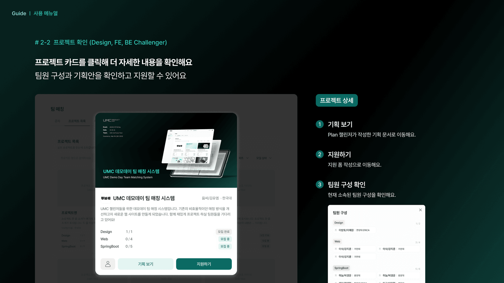

</details>

<details>
<summary><strong>3. 지원하기</strong> — 지원 폼을 작성해 제출하고 지원 현황을 확인합니다</summary>

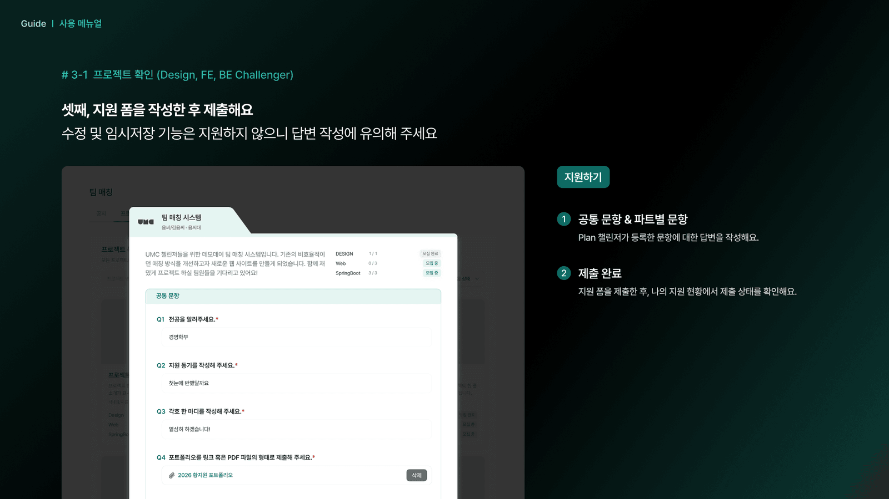
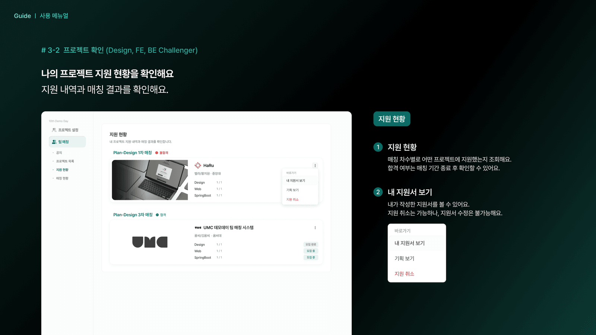

</details>

<details>
<summary><strong>4. 지원자 심사</strong> — Plan 챌린저가 합·불을 판정해 최종 팀원을 선발합니다</summary>

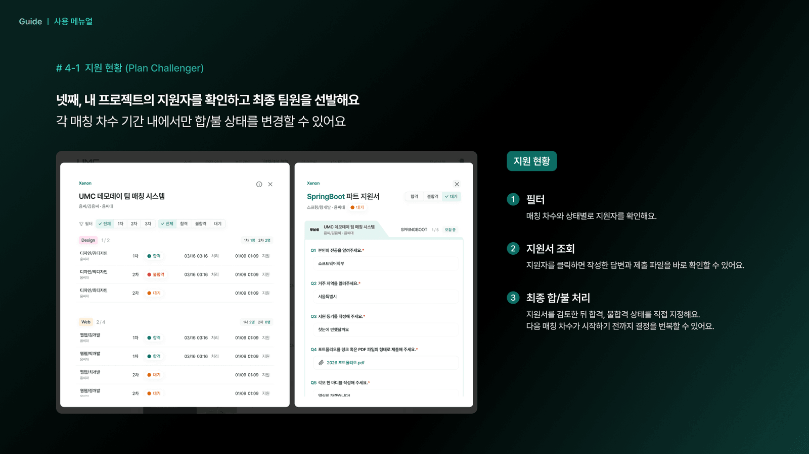

</details>

<details>
<summary><strong>5. 매칭 현황</strong> — 지부별 매칭 통계와 결과 시트를 실시간으로 조회합니다</summary>

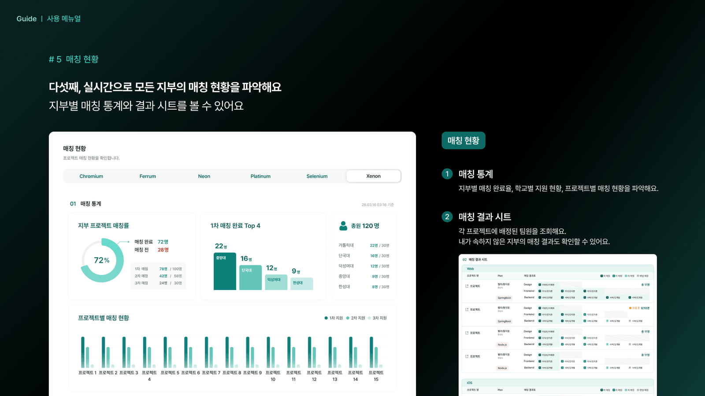

</details>

<details>
<summary><strong>6. 사용자 경험 조사</strong> — 매칭 경험에 대한 만족도를 수집합니다</summary>

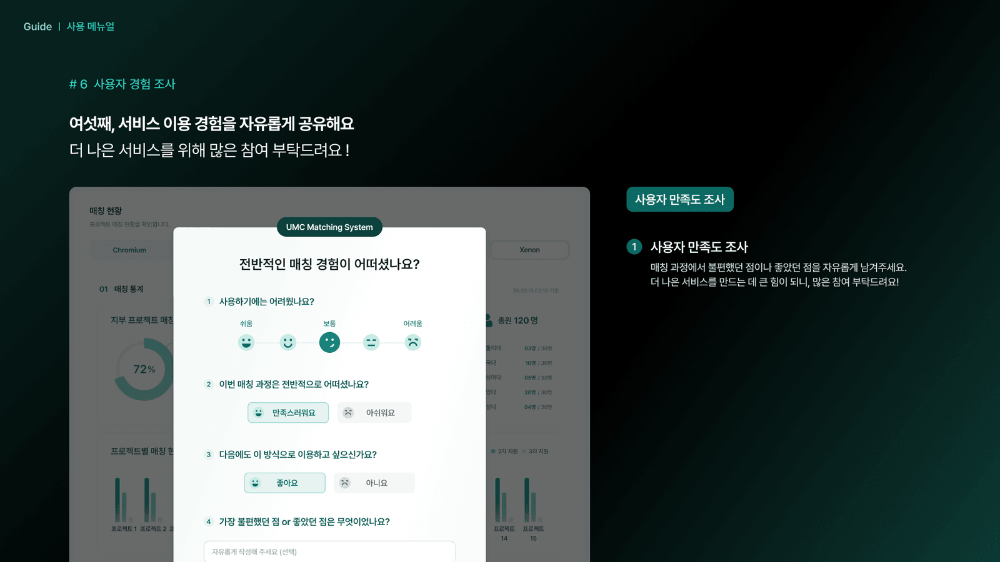

</details>

<br/>
<br/>

## 🖥️ 주요 화면

> 같은 페이지라도 권한에 따라 다른 뷰가 렌더링되므로, 화면마다 해당 역할을 함께 표기했습니다.
> 데모데이 매칭 화면은 위 [사용 가이드](#-팀-매칭-시스템-사용-가이드)에서 확인할 수 있습니다.

### 공통

**로그인** · 자체 로그인과 카카오·구글·애플 OAuth를 함께 제공합니다.

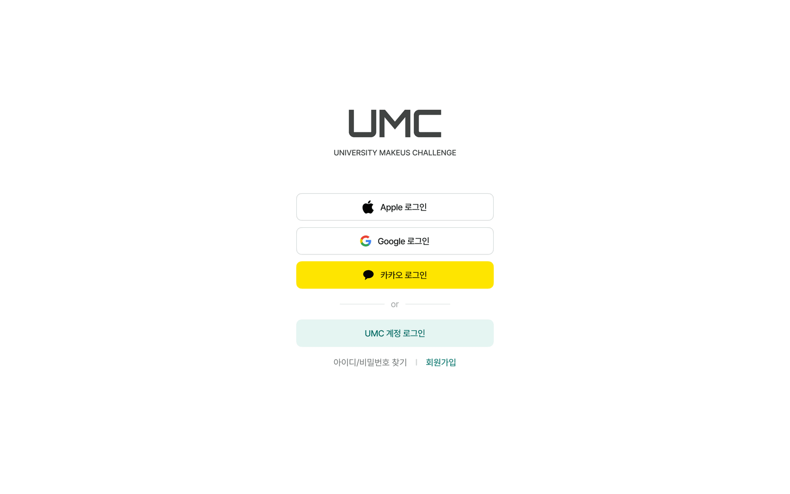

### 리크루팅

> 개발 완료, 실서비스 미배포 화면입니다.

<details>
<summary><strong>운영진 화면</strong> — 모집 공고 등록, 지원 현황 대시보드, 서류·면접 평가</summary>

**모집 공고 등록** · 3단계(기본 정보 → 모집 문항 → 모집 공고) 중 문항 구성 단계입니다. 공통·파트별 섹션을 나누고 문항 유형 5종을 지정합니다.

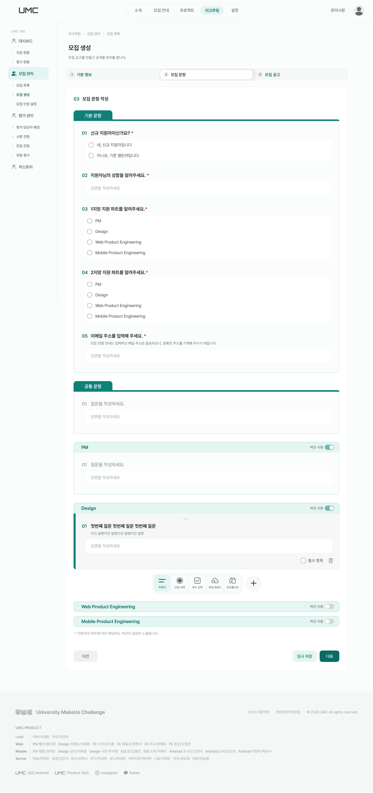

**지원 현황 대시보드** · 지부·학교·파트별 지원자 집계를 차트로 조회합니다.

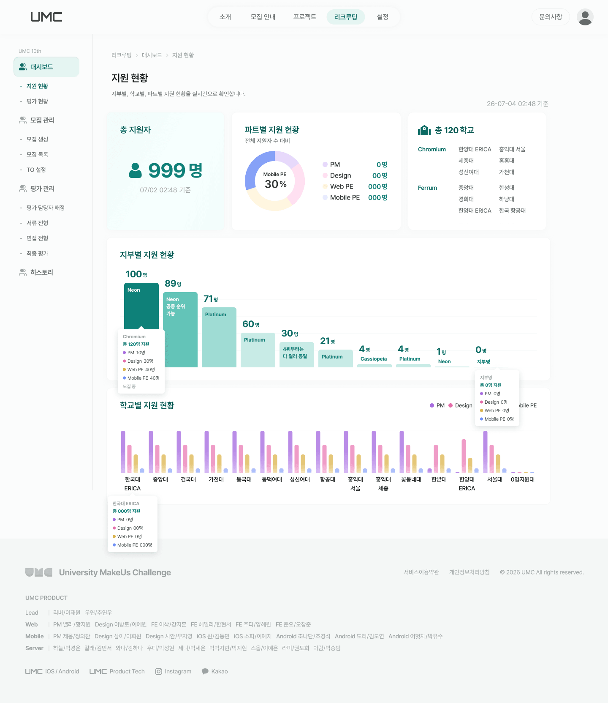

**서류 · 면접 평가** · 지원서를 좌측에 두고 우측에서 단계별 평가를 입력합니다. 다른 평가자의 판정도 함께 확인합니다.

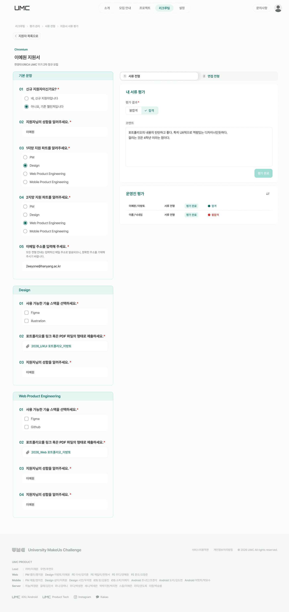

</details>

<details>
<summary><strong>지원자 화면</strong> — 지원서 작성, 내 지원 현황</summary>

**지원서 작성** · 비로그인 상태로 공개 모집 공고를 확인하고 지원서를 제출합니다.

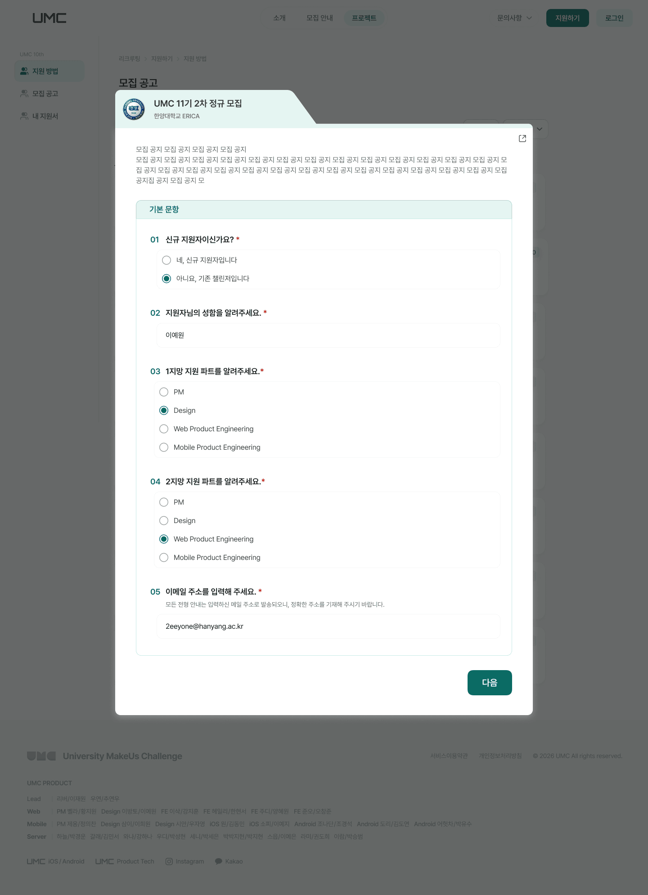

**내 지원 현황** · 제출한 지원서와 단계별 진행 상태를 조회합니다.

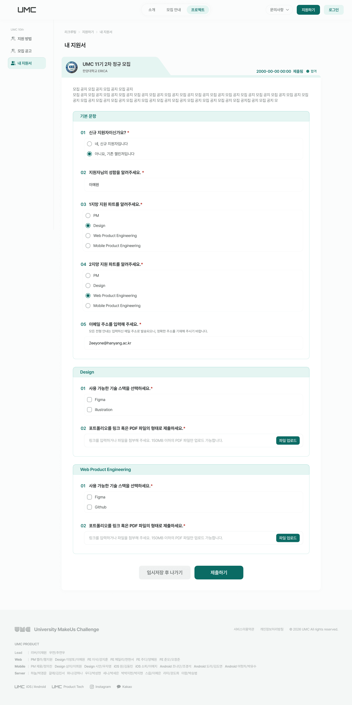

</details>

<br/>
<br/>

## 👩‍💻 Web 파트

|                                                    이삭 / 강지훈                                                     |                                                    헤일리 / 한현서                                                     |                                                     주디 / 양혜원                                                      |                                                     준오 / 오창준                                                      |
| :------------------------------------------------------------------------------------------------------------------: | :--------------------------------------------------------------------------------------------------------------------: | :--------------------------------------------------------------------------------------------------------------------: | :--------------------------------------------------------------------------------------------------------------------: |
|  |  |  |  |
|                                                 `Web Developer Lead`                                                 |                                                    `Web Developer`                                                     |                                                    `Web Developer`                                                     |                                                    `Web Developer`                                                     |
|                               [@theSnackOverflow](https://github.com/theSnackOverflow)                               |                                     [@hyunseo-han](https://github.com/hyunseo-han)                                     |                                    [@hyewonimdang](https://github.com/hyewonimdang)                                    |                                          [@OCJune](https://github.com/OCJune)                                          |

<br/>
<br/>

## ⚒️ 기술 스택


| 카테고리              | 기술 스택                                                                                                                                                                                                                                                                                                                                                                                                       | 선정 이유                                                                                                               |
| :-------------------- | :-------------------------------------------------------------------------------------------------------------------------------------------------------------------------------------------------------------------------------------------------------------------------------------------------------------------------------------------------------------------------------------------------------------- | :---------------------------------------------------------------------------------------------------------------------- |
| **UI Library**        |                                                                                                                                                                                                                                                                                                            | 컴포넌트 단위 재사용으로 역할별로 갈라지는 화면(운영진/Plan 챌린저/기타 챌린저)을 공통 UI 위에서 조립하기 위해 선택     |
| **Language**          |                                                                                                                                                                                                                                                                                            | 서버 API 스키마가 자주 바뀌는 환경에서 타입으로 계약을 고정해 런타임 에러를 사전에 차단                                 |
| **Build Tool**        |                                                                                                                                                                                                                                                                                                                | 빠른 HMR과 빌드 속도로 개발 사이클 단축, 플러그인 생태계(svgr·imagetools)를 그대로 활용                                 |
| **Routing**           |                                                                                                                                                                                                                                                                                      | 파일 기반 라우팅 + 타입 세이프 파라미터로 권한별 중첩 레이아웃과 검색 파라미터를 안전하게 관리                          |
| **Server State**      |                                                                                                                                                                                                                                                                                    | 지원 현황·매칭처럼 갱신이 잦은 목록의 캐싱·무효화 전략을 일원화해 네트워크 비용과 UI 깜빡임을 줄임                      |
| **Client State**      |                                                                                                                                                                                                                                                                                                                                    | 인증 토큰·뷰 모드 등 소수의 전역 상태를 보일러플레이트 없이 관리                                                        |
| **Form / Validation** |                                                                                                                                                                                       | 문항 수가 가변인 지원서 폼을 비제어 방식으로 처리하고, Zod 스키마로 검증 규칙과 타입을 한 곳에서 정의                   |
| **Styling / UI**      |                                                                                                                | 디자인 토큰을 `@theme`으로 노출해 일관성을 확보하고, 접근성이 검증된 헤드리스 프리미티브 위에 자체 스타일을 입힘        |
| **Interaction**       |                                                                                                                                                                                                                                    | 지원서 문항 순서 편집에 접근성을 갖춘 드래그 앤 드롭이 필요했고, 화면 전환 모션을 선언적으로 처리                       |
| **HTTP / API Type**   |                                                                                                                                                                                     | 인터셉터로 토큰 주입·재발급·공통 에러 처리를 중앙화하고, OpenAPI 스펙에서 응답 타입을 자동 생성해 수기 타입 정의를 제거 |
| **Test**              |                                                                                                                                                                               | Vite 설정을 그대로 재사용해 별도 번들 설정 없이 컴포넌트 단위 테스트를 작성                                             |
| **Code Quality**      |                                                                                                      | import 정렬·레이어 경계까지 린트로 강제해 4인 협업에서 발생하는 diff 노이즈와 구조 드리프트를 차단                      |
| **Package Manager**   |                                                                                                                                                                                                                                                                                                                    | 디스크 효율과 엄격한 의존성 격리를 위해 선택, Corepack으로 팀 전체 버전을 고정                                          |
| **Deployment / CI**   |                                                                                                                                                                  | PR마다 lint·경계 체크·빌드를 자동 검증하고, main/develop 머지 시 자동 배포되는 파이프라인을 구성                        |
| **Collaboration**     |     | 디자인 핸드오프, 문서화, 이슈 관리, 실시간 커뮤니케이션을 위해 활용                                                     |

<br/>
<br/>

## 📁 폴더 구조

> **FSD(Feature-Sliced Design)** 를 채택해 `app → routes → widgets → features → entities → shared` 방향의 단방향 의존만 허용합니다.
> 레이어 경계는 `eslint-plugin-boundaries`로 검사하고, CI에서 래칫(ratchet) 방식으로 관리합니다.

```
└── 📁 src/
    ├── 🚀 app/              // 앱 조립 루트 (main.tsx, app.css, authWiring.ts)
    │
    ├── 🧭 routes/           // TanStack Router 파일 기반 라우트
    │   ├── admin/           // 운영진 전용
    │   ├── manage/          // 조직 관리 (지부·학교·커리큘럼)
    │   ├── matching/        // 매칭
    │   ├── projects/        // 프로젝트 탐색·지원
    │   ├── recruiting/      // 리크루팅 현황
    │   └── ...              // routeTree.gen.ts는 자동 생성 (수정 금지)
    │
    ├── 🧱 widgets/          // 여러 페이지가 공유하는 복합 UI
    │   ├── navigation/
    │   └── footer/
    │
    ├── 🧩 features/         // 도메인별 기능 단위 (ui / model / api / hooks)
    │   ├── application/     // 지원서 작성·심사
    │   ├── auth/            // 인증
    │   ├── challenger/      // 챌린저 관리
    │   ├── matching/        // 매칭 차수·결과
    │   ├── project/         // 공고 등록·관리
    │   ├── recruiting/      // 지원 현황·평가 현황
    │   └── ...
    │
    ├── 🧬 entities/         // 화면 간 공유되는 도메인 데이터
    │   ├── application/
    │   ├── member/
    │   ├── organization/
    │   └── project/
    │
    ├── 🛠 shared/           // 도메인 비의존 공용 자원
    │   ├── ui/              // Primitive 컴포넌트 (Button, Modal, Dropdown, Toast)
    │   ├── lib/             // axios 인스턴스, authBridge, cn() 등
    │   └── assets/          // SVG 아이콘 (svgr 자동 생성)
    │
    ├── 🎨 styles/           // 디자인 토큰 CSS (color, typography, shadow)
    ├── 📚 types/            // 전역 타입 (api.d.ts는 OpenAPI에서 자동 생성)
    └── ✅ test/             // Vitest 전역 설정
```

<details>
  <summary><strong>📌 구조 설계 포인트</strong></summary>
  <br/>

- **레이어 단방향 의존**: 하위 레이어가 상위 레이어를 참조하는 역방향 의존은 CI에서 무관용으로 차단합니다.
- **슬라이스 간 수평 결합 래칫**: 같은 레이어 슬라이스끼리의 결합은 baseline 수치로 관리해, 늘어나면 실패하고 줄어들면 baseline 갱신을 강제합니다.
- **도메인 단위 슬라이스**: `features/<domain>/` 내부를 `ui` / `model` / `api` / `hooks`로 나눠 변경 영향 범위를 좁혔습니다.
- **자동 생성 파일 분리**: `routeTree.gen.ts`, `types/api.d.ts`, `shared/assets`의 SVG 컴포넌트는 모두 도구가 생성하므로 직접 수정하지 않습니다.

</details>

<br/>
<br/>

## 🤖 기술 의사결정

> 단순 구현을 넘어 실제 운영 가능한 수준의 안정성과 확장성을 확보하기 위해 도입한 기술·패턴입니다.

<details>
<summary>🔐 토큰 재발급 동시성 제어 (Refresh Queue)</summary>
<br/>

**문제**
액세스 토큰 만료 시점에 여러 요청이 동시에 401을 받으면, 각 요청이 개별적으로 재발급을 시도해 Race Condition이 발생합니다.

**해결**
`shared/lib/axios.ts`의 응답 인터셉터에서 `isRefreshing` 플래그로 재발급을 단일화하고, 그 사이 실패한 요청은 `pendingQueue`에 적재합니다.
재발급이 완료되면 큐를 일괄 drain해 새 토큰으로 재시도하고, 실패하면 큐 전체를 reject한 뒤 한 번만 로그인 화면으로 리다이렉트합니다.

**팀 합의**
인증 안정성이 서비스 신뢰도와 직결된다고 판단해, 단순 재요청이 아닌 **큐 기반 동시성 제어를 프로젝트 표준으로 채택**했습니다.

</details>

<details>
<summary>🧱 FSD 레이어 경계 래칫 (Boundaries Ratchet)</summary>
<br/>

**문제**
아키텍처 규칙을 문서로만 정하면 일정에 쫓길 때 조용히 무너지고, 반대로 모든 위반을 즉시 에러로 막으면 기존 코드 때문에 CI가 상시 실패합니다.

**해결**
`scripts/check-boundaries.mjs`에서 위반을 방향별로 분류해 두 가지 정책을 적용합니다.

- **upward(역방향) 위반**: baseline 없이 무조건 실패
- **lateral(같은 레이어 수평 결합)**: baseline 수치를 넘으면 실패, 줄어들면 baseline 갱신을 강제

**팀 합의**
"지금 당장 완벽하게"가 아니라 **단조 감소만 허용**하는 방식으로, 구조 부채가 늘지 않으면서 점진적으로 개선되도록 합의했습니다.

</details>

<details>
<summary>🧬 OpenAPI 기반 API 타입 자동 생성</summary>
<br/>

**문제**
서버 스펙 변경을 프론트에서 수기 타입으로 추종하면 누락이 발생하고, 타입은 통과하는데 런타임에서 깨지는 상황이 반복됩니다.

**해결**
`openapi-typescript`로 `openapi.yaml`에서 `src/types/api.d.ts`를 생성하고(`pnpm generate:api-types`), 도메인 코드는 생성된 타입을 참조합니다.
공통 응답 래퍼는 `shared/lib/apiResponse`의 `ApiResponse<T>`로 일반화했습니다.

**팀 합의**
API 계약의 단일 출처를 서버 스펙으로 두기로 하고, **생성 파일 직접 수정을 금지**했습니다.

</details>

<details>
<summary>🎨 디자인 토큰 + CVA 기반 컴포넌트 variant</summary>
<br/>

**문제**
Tailwind 클래스를 컴포넌트마다 직접 나열하면 같은 버튼이 화면별로 미세하게 달라지고, 디자인 변경 시 수정 지점이 흩어집니다.

**해결**
`src/styles/`의 color·typography·shadow 토큰을 Tailwind v4 `@theme`으로 노출하고, 반복 컴포넌트는 `class-variance-authority`로 variant를 타입 안전하게 정의했습니다(`src/shared/ui`).
모달·드롭다운·툴팁 등은 Radix UI 헤드리스 프리미티브 위에 스타일만 입혀 접근성을 확보했습니다.

**팀 합의**
디자인 시스템을 **코드에서 강제 가능한 형태**로 유지하기 위해 토큰 외 하드코딩 색상 사용을 지양하기로 했습니다.

</details>

<details>
<summary>🔍 SPA + 부분 프리렌더링(SSG)으로 SEO 확보</summary>
<br/>

**문제**
서비스 대부분이 로그인 이후의 대시보드라 SPA가 적합하지만, 소개·모집 안내 페이지는 검색 노출이 필요합니다.

**해결**
`scripts/prerender.mjs`에서 puppeteer로 빌드 결과를 띄운 뒤 `/about`, `/recruiting-guide`, `/login`, `/signup` 등 공개 경로만 정적 HTML로 스냅샷합니다(`pnpm build:ssg`).
프리렌더 중에는 GA 관련 호스트를 차단해 집계 오염을 막습니다.

**팀 합의**
SSR 프레임워크 전환 비용 대신 **필요한 경로만 프리렌더링**하는 선택지를 채택했습니다.

</details>

<details>
<summary>⚙️ 커밋·PR 품질 게이트 자동화</summary>
<br/>

**해결**
`husky` + `lint-staged`로 커밋 시 스테이지된 파일만 ESLint --fix와 Prettier를 적용하고, `commitlint`(gitmoji 규약)로 커밋 메시지를 검증합니다.
PR에서는 GitHub Actions가 `lint` → `lint:boundaries` → `build` 순으로 검증합니다.

**팀 합의**
"항상 배포 가능한 상태"를 유지하기 위해 **자동화된 품질 게이트 운영에 합의**했습니다.

</details>

<br/>
<br/>

## 🛠 개발 환경

### 필요 버전

- Node.js `>= 22.12.0` (`.nvmrc` 기준 22)
- pnpm `10.28.0` (Corepack 사용 권장)

### 설치

```bash
corepack enable
pnpm install
```

### 환경 변수

`.env.example`을 복사해 `.env`를 만든 뒤 값을 채웁니다.

```bash
cp .env.example .env
```

| 변수명                    | 설명                        |
| :------------------------ | :-------------------------- |
| `VITE_API_BASE_URL`       | 백엔드 API 베이스 URL       |
| `VITE_GA_MEASUREMENT_ID`  | Google Analytics 측정 ID    |
| `VITE_GA_API_SAMPLE_RATE` | GA 이벤트 샘플링 비율       |
| `VITE_APPLE_CLIENT_ID`    | Apple 로그인 클라이언트 ID  |
| `VITE_APPLE_REDIRECT_URI` | Apple 로그인 리다이렉트 URI |
| `VITE_GOOGLE_CLIENT_ID`   | Google 로그인 클라이언트 ID |
| `VITE_KAKAO_APP_KEY`      | 카카오 로그인 앱 키         |

### 실행

```bash
pnpm dev          # 개발 서버
pnpm build        # 프로덕션 빌드
pnpm build:ssg    # 프로덕션 빌드 + 프리렌더(SSG)
pnpm preview      # 빌드 미리보기
```

<details>
<summary><strong>📜 그 외 스크립트</strong></summary>
<br/>

| 스크립트                       | 설명                                               |
| :----------------------------- | :------------------------------------------------- |
| `pnpm lint`                    | ESLint 검사                                        |
| `pnpm lint:fix`                | ESLint 자동 수정                                   |
| `pnpm lint:boundaries`         | FSD 레이어 의존성 위반 래칫 검사                   |
| `pnpm format` / `format:check` | Prettier 포맷팅 적용 / 검사                        |
| `pnpm test` / `test:run`       | Vitest watch 실행 / 1회 실행                       |
| `pnpm generate:api-types`      | OpenAPI 스펙(`openapi.yaml`)에서 TS 타입 자동 생성 |
| `pnpm svgr`                    | `public`의 SVG를 React 컴포넌트로 변환             |

</details>

### Storybook

공통 UI와 모집·지원·매칭·평가 feature UI의 상태와 사용법은 Storybook에서 확인합니다. feature story에는 실제 사용 라우트도 표시되지만, 인증이나 앱 라우터를 실행하지 않습니다. 스토리는 컴포넌트 파일 옆의 `*.stories.tsx`에 작성하며, 대표 위치는 `src/shared/ui`와 `src/features`입니다. 상세 구조와 작성 규칙은 [Storybook 인수인계 문서](docs/storybook-handoff.md)를 참고합니다.

```bash
pnpm storybook
pnpm build-storybook
```

<br/>
<br/>

## 🌿 개발 가이드

### 브랜치 전략

`<타입>/<작업 내용>` 형식의 브랜치를 `develop`에서 분기해 PR로 병합합니다.
이슈 번호를 포함하는 경우 `feat/#123-기능명` 형식을 사용합니다.

| 접두사      | 용도                    |
| :---------- | :---------------------- |
| `feat/`     | 신규 기능               |
| `fix/`      | 버그 수정               |
| `refactor/` | 기능 변경 없는 리팩토링 |
| `chore/`    | 빌드/설정/배포 등       |
| `task/`     | 문서화 등 기타 작업     |

### 커밋 컨벤션

[Gitmoji](https://gitmoji.dev/) 규약을 따르며, `commitlint`가 메시지를 자동 검증합니다.

```
✨ feat: 새로운 기능 추가
🐛 fix: 버그 수정
🔧 chore: 빌드 설정, 의존성 업데이트 등
♻️ refactor: 기능 변경 없는 코드 리팩토링
📝 docs: 문서 수정
✅ test: 테스트 코드 추가 및 수정
🎨 style: 코드 포맷팅, 구조 개선
```

<br/>
<br/>

## 🚀 배포 & 운영

| 항목          | 내용                                                                                                                                |
| :------------ | :---------------------------------------------------------------------------------------------------------------------------------- |
| **호스팅**    | AWS Amplify (`amplify.yml`) - `pnpm install --frozen-lockfile` → `pnpm run build`, 산출물 `dist/`, SPA 리라이트 적용                |
| **CI**        | GitHub Actions (`.github/workflows/ci.yml`) - `main`·`develop` 대상 PR에서 `lint` → `lint:boundaries` → `build`                     |
| **버전 관리** | `CHANGELOG.md`에 [Keep a Changelog](https://keepachangelog.com/ko/1.1.0/) 형식, [SemVer](https://semver.org/lang/ko/) 기준으로 기록 |
| **SEO**       | `scripts/prerender.mjs`로 공개 경로 정적 프리렌더링, `public/sitemap.xml` · `public/robots.txt` 제공                                |
| **모니터링**  | Google Analytics 4 + `web-vitals` 기반 성능 지표 수집                                                                               |

<br/>
<br/>

## 📮 문의

버그 제보 및 기능 제안은 [UMC PRODUCT 카카오톡 채널](https://pf.kakao.com/_MDxhqX/chat)로 연락해주세요.
